# Summary

- [Hey! I'm glad you here!](#hey-i-m-glad-you-here)
- [How to work with RenPy](#how-to-work-with-renpy)
- - [Special symbols](#special-symbols)
- - [Variables](#variables)
- - [Quotations](#quotations)
- [How to work with GitHub](#how-to-work-with-github)
- [How translations were done before me?](#how-translations-were-done-before-me)
- [What to translate](#what-to-translate)
- [Character names](#character-names)

# Hey! I'm glad you here!

I'm really happy that you want to help with translations!

I'm making this document because I'm getting some number of requests like this and although I'm super happy to get you help, I can't manually copy paste all the translated lines. So we have a process and here I'm going to explain how it works.  
First of all, translation are done with the [Ren'py](https://www.renpy.org/) framework.

# How to work with RenPy

RenPy is quite simple. Every scene in the game is translated in a separate file like "d04s03.rpy".  
Such file looks like this:

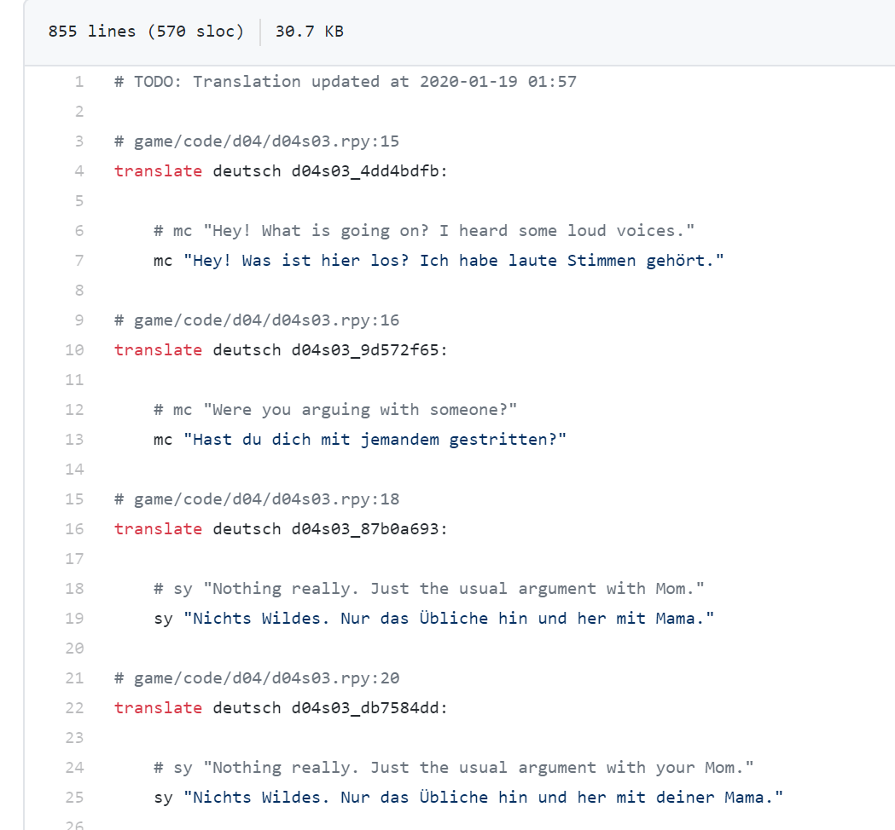

This example is already a translated file. In the file, you would see all the lines of the text mentioned in English, and right after it the language that you are translating to.

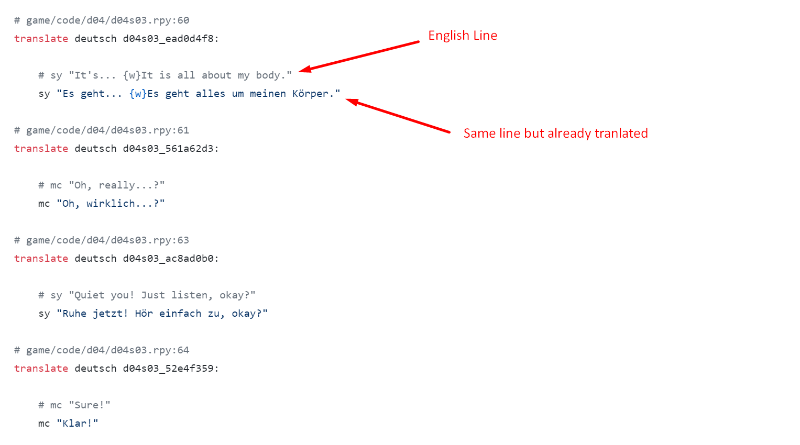

What type of things you might see?

## Special symbols

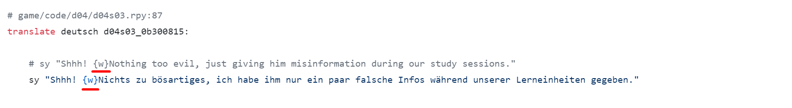  

Those are special action symbols. They need to stay the same preferably in the same logical place. For example, this symbol is making a pause in the dialog.  
Also `{i}...{/i}` is to make text cursive.

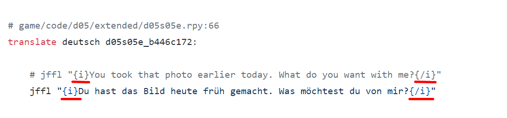

And you see "%%" like here:

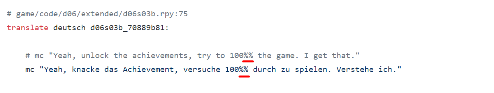

It has to be translated like that. "%" is a special character.

## Variables

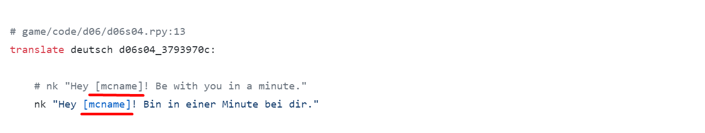

Those are used to be replaced with something. In most cases that is character names. (In this case, it will be replaced with the name that player selected for him main character).

## Quotations

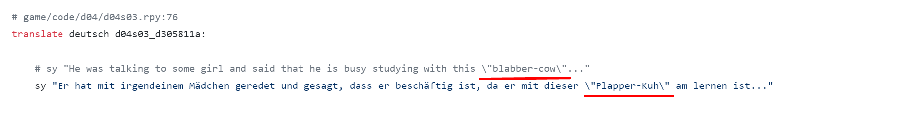

Those are quotes that need to be escaped to work properly. Be very careful with those. The wrong quote can break the whole game.  
You can read more about RenPy syntax here:  
[https://www.renpy.org/dev-doc/html/translations.html](https://www.renpy.org/dev-doc/html/translations.html)  
If there is something not clear reach out on our [Discord](https://discord.gg/b6CNu2C) on the #translations channel (ask if you need access). 

# How to work with GitHub

[Github](https://github.com/) is a code management platform that is using Git.

First of all, you would need to create an account on Github (if you don't have one) or you can create a fake one just in case you don't want to use your professional one. Go here and create it: [https://github.com/](https://github.com/)  
Once you have an account you can open on the repositories that we have for translations:

**Translations for week-1** - url: [https://github.com/vinovella/FL-week-1-translations](https://github.com/vinovella/FL-week-1-translations)  
**Translations for week-2** - url: [https://github.com/vinovella/FL-week-2-translations](https://github.com/vinovella/FL-week-1-translations)

You should see this:

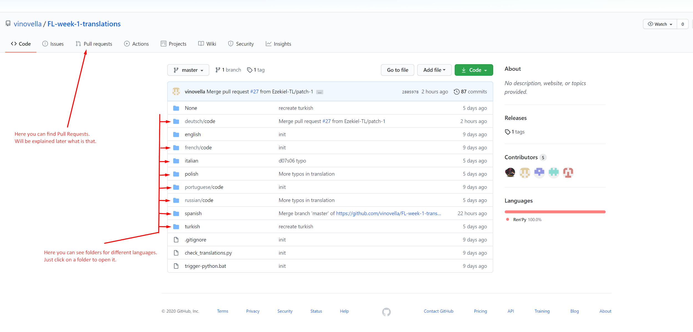

When you would open the language that you want to translate(if your language is not in the list you need to contact us and we will create it) you will see next:

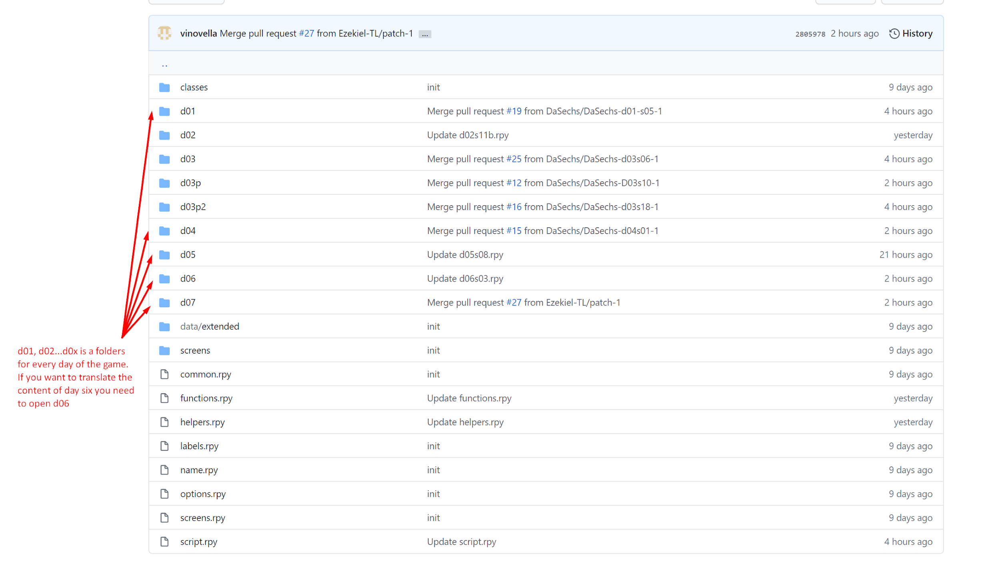

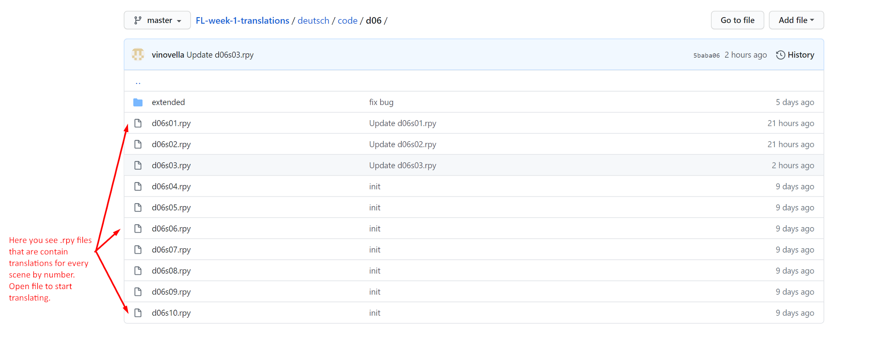

To start editing the file:

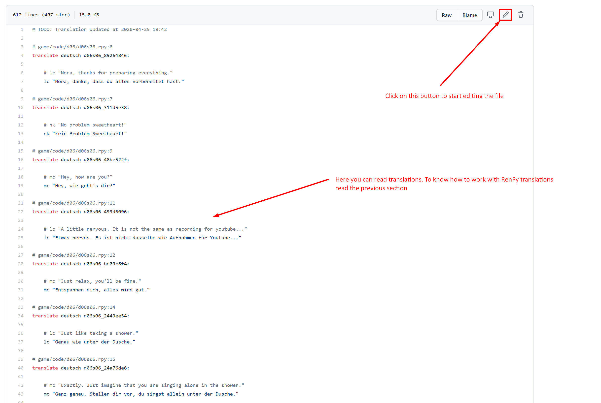

You will see the texteditor:

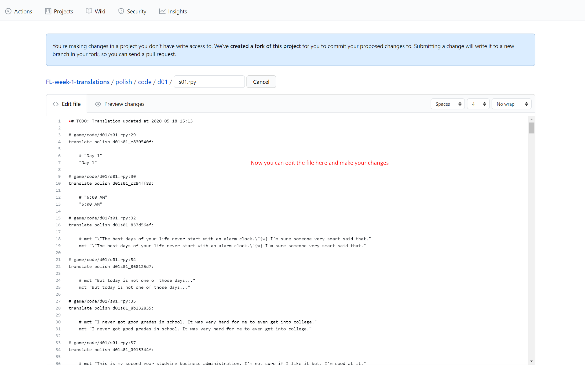

You make changes:

To save (propose) your changes:

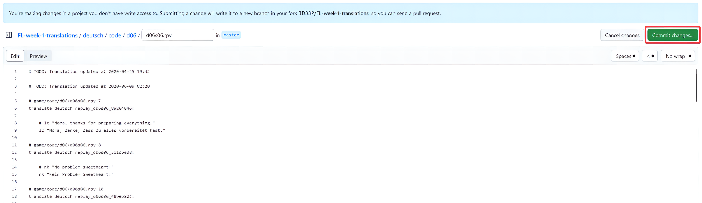

You will see the screen with what you changed. And you need to create a Pull Request to send this change to my translation repository:

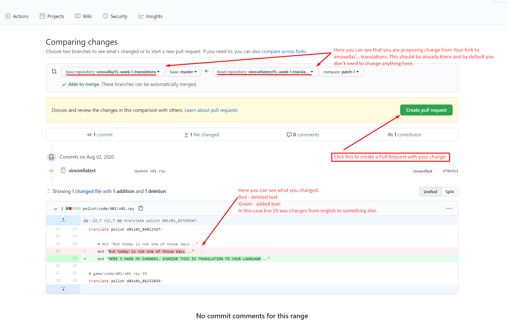

And one more step:

Now it is done. You can see the number of opened pull requests:

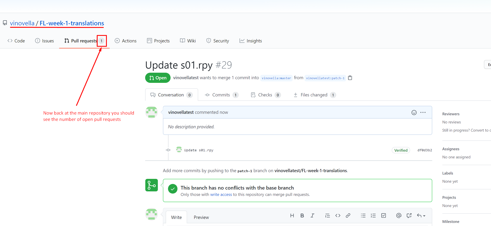

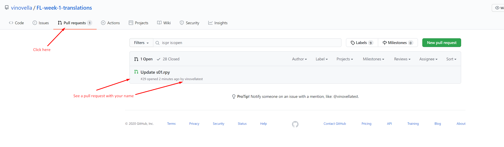

If you already created a pull request and you want to edit it you still can change a file there:

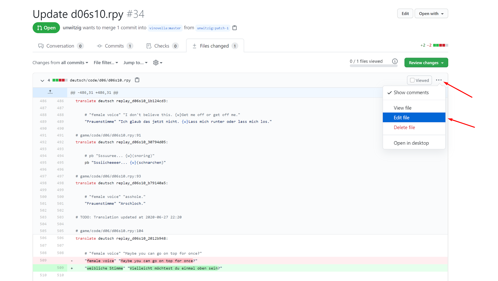

# How translations were done before me?

If you want to find out how certain things were already translated before you can use search:

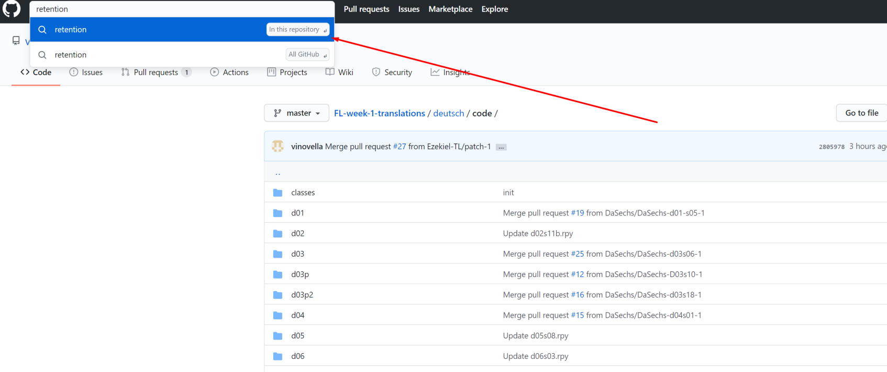

and there find already translated file with this word:

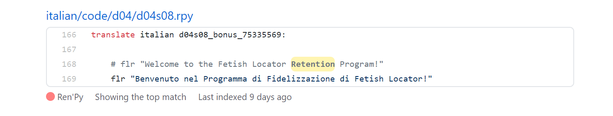

# What to translate

To find what to translate you can ask on the translating channel or you can check for any file like on the picture to see there the list of untranslated strings:

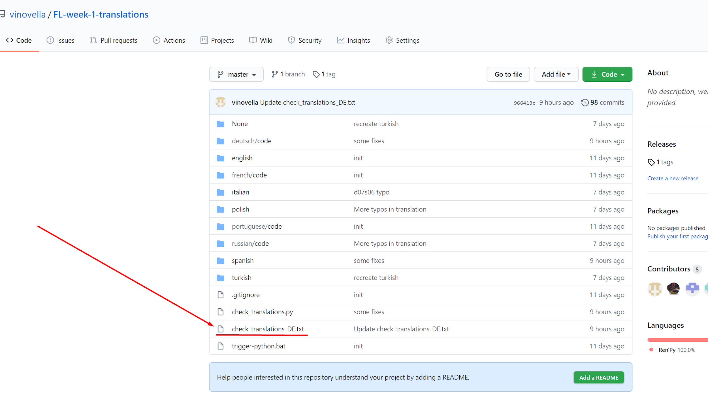

In such file you will find a list of files with strings:

That means that this file is missing translations. If you want to start working on this file you need to send a message to the #translations channel on discord to let others know that you are working on this file and no one else will be working on it.

If you are doing your first translation please ask someone to check it for you.

# Character names

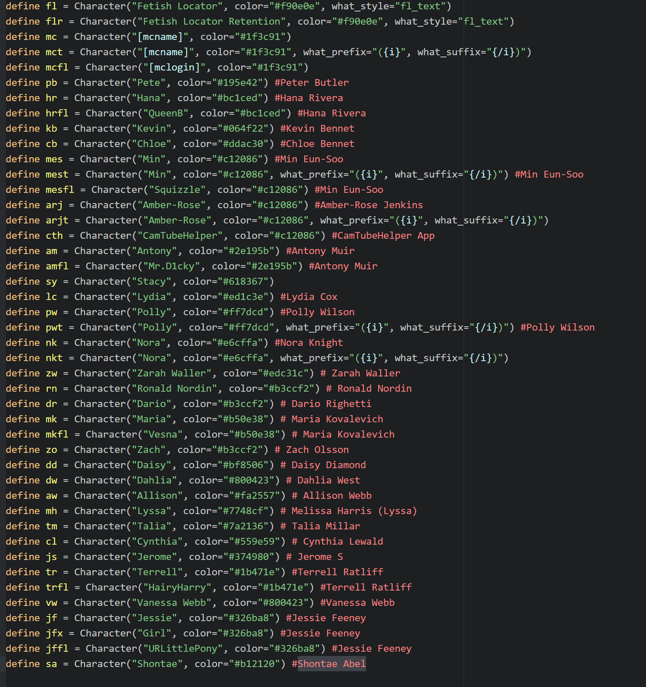
